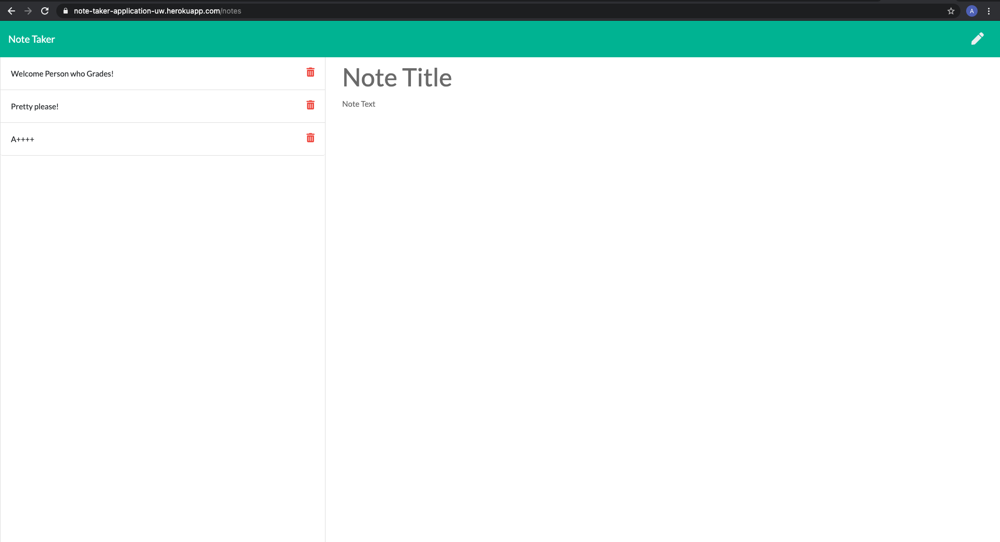

# Note-Taker-Application

## Table of Contents

- [Developer Comment](#developer-comment)
- [Employer Request](#employer-request)
- [User Story](#user-story)
- [Acceptance Criteria](#acceptance-criteria)
- [Website Features and Highlights](#website-features-and-highlights)
- [Live Project Site](#live-project-site)
- [Installation and Git Repository](#installation-and-git-repository)
- [Credits](#credits)

## Developer Comment

Hello everyone, and welcome back to my Repo! My name is Abdulhakeem Dahir and I am an aspiring Software Developer. This week I have been tasked to make a Note Taker Application. This application requires us to use Node, Express and Heroku. We have to correctly route pages and use post data to modify our db.json. It will need to have GET, POST, and DELETE functionality. Any feedback is welcome! Thank you!

## Employer Request

For users that need to keep track of a lot of information, it's easy to forget or be unable to recall something important. Being able to take persistent notes allows users to have written information available when needed.

### User Story

```
AS A user, I want to be able to write and save notes

I WANT to be able to delete notes I've written before

SO THAT I can organize my thoughts and keep track of tasks I need to complete
```

### Acceptance Criteria

```
Application should allow users to create and save notes.

Application should allow users to view previously saved notes.

Application should allow users to delete previously saved notes.
```

## Website Features and Highlights

The follwing are all of the feautres and highlights of my portfolio:

### Node, Express & Heroku

```
- Created express routes
- Created get, post and delete routes
- Created Javascript Logic with FS Module
- Parsed and Stringified JSON into db.json
- Deployed to Heroku

```

## Live Project Site

https://note-taker-application-uw.herokuapp.com/notes



## Installation and Git Repository

Respository: https://github.com/abdulhakeemdahir/Note-Taker-Application

Please follow the installation process below:

```
1. Fork the repository from the link above
2. Clone the repo to your computer via git
3. Open the project files with the text editor of your choice.
```
